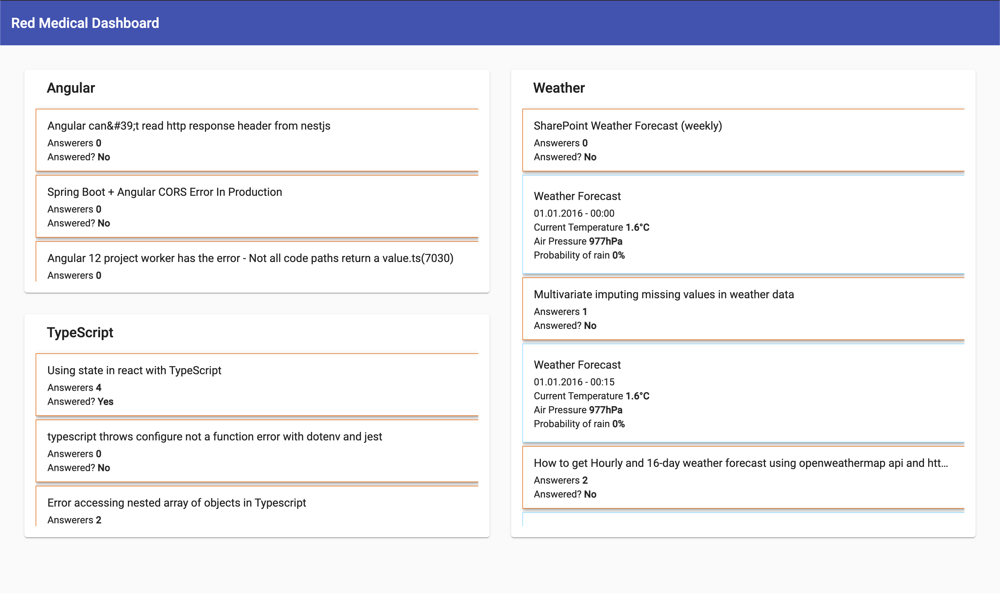

<p align="center">
  <h3 align="center">Red Medical Dashboard</h3>

  <p align="center">
    A simple dashboard demonstrating how to write reusable angular components, tested with jest and cypress
    <br />
    <a href="https://danielsogl.github.io/redmedical-dashboard/dashboard">View Demo</a>
  </p>
</p>

<!-- TABLE OF CONTENTS -->
<details open="open">
  <summary><h2 style="display: inline-block">Table of Contents</h2></summary>
  <ol>
    <li>
      <a href="#about-the-project">About The Project</a>
      <ul>
        <li><a href="#built-with">Built With</a></li>
      </ul>
    </li>
    <li>
      <a href="#getting-started">Getting Started</a>
      <ul>
        <li><a href="#prerequisites">Prerequisites</a></li>
        <li><a href="#installation">Installation</a></li>
        <li><a href="#installation">Solution in depth</a></li>
        <li><a href="#installation">Tests</a></li>
      </ul>
    </li>
    <li><a href="#usage">Usage</a></li>
  </ol>
</details>

<!-- ABOUT THE PROJECT -->

## About The Project



This project demonstrates how to write reusable Angular components using a `ComponentFactory` and multiple generic TypeScript interfaces or classes.

My goal was to focus on the generic component feature of angular instead of writing a lot of state management code using [ngxs](http://ngxs.io) for example.

### Built With

- [Angular V12](https://angular.io)
- [Angular Material](https://material.angular.io)
- [Spectator](https://ngneat.github.io/spectator/)
- [Jest](https://jestjs.io)
- [Cypress](https://cypress.io)

<!-- GETTING STARTED -->

## Getting Started

To get a local copy up and running, follow these simple steps.

### Prerequisites

You have to use Node.js LTS and npm@6

```sh
npm install npm@6 -g
```

### Installation

1. Clone the repo
   ```sh
   git clone https://github.com/danielsogl/redmedical-dashboard.git
   ```
2. Install npm packages
   ```sh
   npm install
   ```
3. Start the application
   ```sh
   npm run start
   ```

<!-- SOLUTION -->

## Solution in depth

### Application Structure

The application follows the `FeatureModule` way and lazy loads the `Dashboard` route. Of corse a `CoreModul` and `SharedModule` is used to separate shared and initial required components.

### Component Factory

Angular allows creating dynamic component by calling a [ComponentFactoryResolver](https://angular.io/api/core/ComponentFactoryResolver) and render the result in a given view container. With that feature it is possible to generate a generic `WidgetComponent` accepting a generic `WidgetItem` class array.

The `WidgetContentItemComponent` then resolves the specified component class and renders it.

### Generics

I added as much generic interfaces as possible and useful for the simple application. They could be extended to define more inputs like a `loading` input to display a loading spinner in the future.

The demo app defines a generic widget item containing a `data` input.

```ts
import { Type } from "@angular/core";

export class WidgetItem<T, K> {
  component: Type<T>;
  data: K;

  constructor(component: Type<T>, data: K) {
    this.component = component;
    this.data = data;
  }
}

export interface WidgetContent<T> {
  data: T;
}
```

### Things I would add in a more complex application

Normally I use the library [ngxs](https://www.ngxs.io) to handle my application state. For this demo project It would be a complete overkill, so I decided to not include state management.

I would also add a Docker Setup for local development and production deployment. To simplify that, I used a simple GitHub Pages action to deploy the app.

<!-- TESTS -->

## Tests

Every line of code is covered with a useful unit tests (containing also UI tests). The application itself is covered by e2e tests.

### Unit Tests

This project uses jest to run the tests in general and the [Spectator](https://ngneat.github.io/spectator/) library in detail to write angular specific unit tests. The library reduces boilerplate code and simplifies the way how to write tests, mocks and spys.

Jest itself reduces the amount of time tests need to run locally and in a CI environment.

### E2E Tests

For e2e tests [Cypress](https://cypress.io) is used to run them. With cypress it is possible to test any web application, so I can use this library to write my e2e tests not only for react but also for my angular applications. The test files can be found in the `cypress` folder.

To start cypress run the following command

```sh
npm run e2e
```
